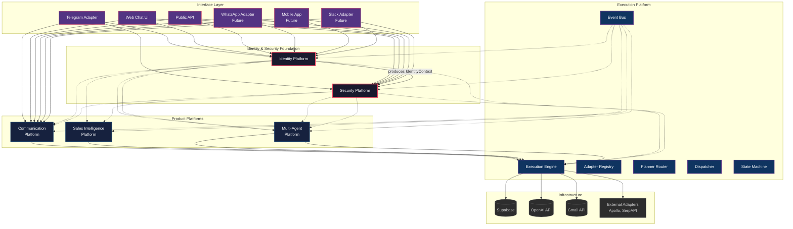

# Platform Dependency Architecture

## Diagram

## Legend

| Line style | Meaning |
|---|---|
| `───` solid | Direct dependency / integration |
| `- - -` dashed | Cross-cutting concern (auth, authorization, audit) |
| `►` arrow | Direction of dependency |

## Layer description

### Foundation Layer (Identity & Security)

The Identity and Security platforms sit **underneath all other platforms**. Every request from every interface passes through both:

1. **Identity Platform** authenticates the request, producing an `IdentityContext`
2. **Security Platform** authorizes the request, enforces rate limits, and audits decisions
3. The authorized `IdentityContext` is forwarded to business logic

No product platform or execution component bypasses Identity or Security.

### Interface Layer

Interface adapters (Telegram, Web, WhatsApp, Mobile, Slack) authenticate through Identity before reaching business logic. Interfaces are thin — they translate protocol to API calls and delegate all business logic downstream.

### Product Platforms

- **Communication Platform** — conversation engine, message routing, reply detection
- **Sales Intelligence Platform** — CRM adapters, contact intelligence, pipeline strategies
- **Memory Platform** — organizational memory, explainability, consolidation
- **Multi-Agent Platform** — specialist agents, coordinator, pipeline orchestration

Each product platform receives an authenticated `IdentityContext` and operates within an Organization boundary.

### Execution Platform

The execution engine schedules, dispatches, and monitors all tasks. It does not authenticate — it receives pre-authenticated tasks from product platforms. The execution engine integrates with:

- Supabase for persistence
- OpenAI for generation
- Gmail for email
- External adapters for lead sourcing

The Event Bus cross-cuts all platforms, including Identity and Security, for event-driven integration.

### Infrastructure

External services accessed through adapters. All infrastructure access is mediated by the Execution Platform.

## Dependency rules

| Rule | Description |
|---|---|
| **Identity first** | Every request is authenticated before any business logic executes |
| **Authorization second** | Every authenticated request is authorized before accessing resources |
| **Foundation stability** | Identity and Security platforms are foundational — no circular dependencies from product platforms into Identity or Security internals |
| **Product isolation** | Product platforms depend on Identity and Security, not vice versa |
| **Interface thinness** | Interfaces authenticate through Identity but do not implement auth logic |
| **Event bus cross-cutting** | Any platform may publish or subscribe to events, including Identity and Security |
